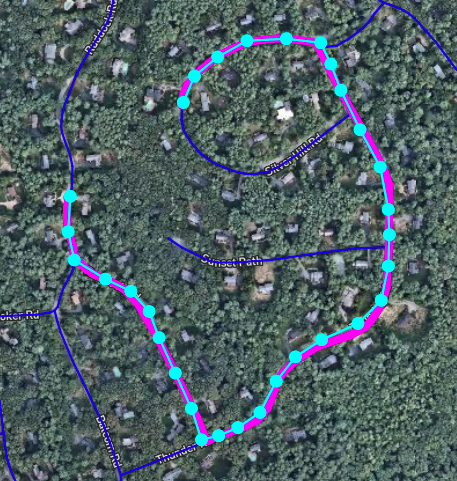

### Overview

Our RoadMotion vehicles upload GPS coordinates as they drive along roads. These coordinates are useful for associating profile data with known roads. However, GPS is inaccurate up to several meters, and will not align perfectly with roads in our database. In order to determine which roads a vehicle traversed, we employ an algorithm called "map matching".

In this assignment, you will be designing and implementing a simple map matching algorithm. You can use any programming language you feel comfortable with to perform this exercise.

### Requirements

Your algorithm will have two inputs:

* A JSON list of road segments, representing known roads in our database
* A JSON list of GPS coordinates reported by a vehicle during a drive

Your algorithm must provide the following output:

* A JSON list of segment IDs which the vehicle most likely traversed

For this exercise, we are not too concerned about the mechanism for providing input and output. You could read/write files, use stdin/stdout, or some other method.

Each road segment is a straight line defined by two endpoints. Road segments are connected to each other by nodes and form a graph. Each road segment has the following format:

```
{
    "segmentId": number,
    "startNode": {
        "nodeId": number,
        "pos": [longitude, latitude]
    },
    "endNode": {
        "nodeId": number,
        "pos": [longitude, latitude]
    }
}
```

If two segments share a node with the same ID, then the segments are connected. The vehicle can only traverse between segments which are connected in this way.

For simplicity, we will assume that the vehicle will **not** perform any U-turns and change direction on the same road segment.

### Example Test Cases

This repository provides several test case files:

* sampleSegments.json contains road segments for all test cases
* inputCase1-3.json contain input GPS coordinates from drive sessions
* outputCase1-3.json contain the expected output your algorithm should produce

For convenience, we are hosting a visualization tool for this assignment:

https://roadmotion.co/takeHome3

For example, this tool shows the following visualization for test case 1:



* Dark blue lines are road segments
* Cyan dots are GPS coordinates from the drive session
* Magenta lines are road segments selected by map matching

### Criteria for a Good Solution

We will consider your solution to be successful if it meets the following conditions:

* Your algorithm should produce the same output as in the example test cases. We will accept small differences in the first and last few segment IDs, but your output should otherwise be identical.
* Your algorithm should also function correctly for input data not included in this repository.
* Your code should run reasonably efficiently. We don't need an optimal solution, but your code should not take several seconds to run.
* Your code should be reasonably easy to follow, and include comments to explain components of your algorithm.


